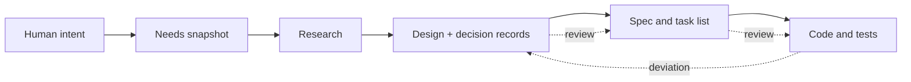

# How doc-driven development with agents works

## Overview

Coding agents have no memory. Every session starts from zero, and whatever you explained yesterday is gone. Most teams fight this by pasting more into the prompt, or by keeping a long-running chat alive and hoping it doesn't compact. Both approaches break the moment a second person, or a second agent, shows up.

This workflow takes the opposite bet. Nothing important is allowed to live in a conversation. Intent, decisions, contracts, current status, open questions, even "where did the last session stop": each has one file that owns it. An agent starts by reading a few short files, works out what state the project is in from what's on disk, does one bounded thing, commits, and leaves. The next agent, or the next colleague, starts the same way. Documents are the product's memory, and the code is checked against them rather than the other way round.

If you only read this section: the point is not "write more docs." It is "make the docs the thing that is true, keep them small enough to read, and check them like you check code."

## Key Concepts

**Docs surface and code surface.** Two places, usually two repositories. The docs side says what the system is, why, and what its contracts are. The code side says what is actually implemented, plus a spec folder that turns design into tasks. They are kept apart on purpose.

**Needs snapshot.** A short file that captures what a human actually wants: the goal, what is in and out of scope, how we'll know it's done. It is written only after a real back-and-forth with the person, and it is the root everything else hangs from.

**Handoff.** The checkpoint for whoever comes next: exact revision, what was verified and how, what's blocked, the next safe step, and what the next agent must *not* decide. Replaced, never appended.

**Decision record.** An append-only note of a choice, the alternatives, and the consequences. You never edit one. To change your mind you write a new one that supersedes it.

**Deviation.** A written admission that reality differs from the design, opened by whoever notices, closed only with an explicit outcome.

**Role.** A hat an agent wears for one task: researcher, doc writer, spec writer, implementer, reviewer, and so on. Each role can read some things, write fewer things, and signs its commits with its own name.

**Coordinator.** The one agent that talks to the human. Everyone else reports back to it.

## How It Works

### Why files instead of chat

An agent that reasons from the conversation is reasoning from a source nobody else can see and nothing can check. A file in git can be diffed, blamed, reviewed, and read by the next person. So the rule is blunt: if it isn't in the repository, it didn't happen. Progress is a commit. A decision is a decision record. A finding is a review file with a severity and a line number. "I'm pretty sure we agreed to X" is not a state the workflow recognises.

This also settles the multi-person question before it comes up. A colleague joining tomorrow and an agent starting a fresh session are the same case. They read the same three files, in the same order, and get the same answer about what's going on.

### Why every folder answers one question

The docs side is split into folders, and each folder answers exactly one question. Design answers "what is this and why." Decisions answer "why this and not that." Engineering answers "what is the current contract." Planning answers "what next, and which human decisions are still owed." Research and reviews are dated evidence. Deviations are the gap between plan and reality.

The reason is not tidiness. It is that an agent with a question should know, before opening anything, which single folder holds the answer, and should be able to stop reading the moment it has it. A sentence that answers the wrong question for its folder is a bug: a delivery status inside a design doc will rot, because nobody updating status thinks to look there.

Two rules fall out of this. First, a fact has one home and every other mention is a pointer. We learned this the expensive way: a status block copied into a second file stopped being updated and quietly misled sessions for two months. Second, upstream never cites downstream. A design document does not link to a research note or a review. If a research conclusion matters, the design says it in its own words and stands on its own.

### How an agent starts cold

Three root files, all short, all with a hard length limit: the behaviour rules, the roles and what each may touch, and an index of where things are. That is the whole "hot memory." Everything else is loaded on demand.

Then the agent looks at the disk and works out the state. Does a needs snapshot exist? Is there research yet? Do the structural checks pass? Does the latest review have open blocking findings? Is there an open deviation? Those answers, not the previous conversation, decide what happens next. If the snapshot is missing, the only legal move is to go back to the human and align. If a review has a blocking finding, the only legal move is to fix it. The agent never asks "what were we doing" because the answer is always computable.

If it is resuming someone else's work, it reads the handoff. The handoff names the exact revision it was written against and what was actually verified, so the reader knows which claims to trust and which to re-check.

### How a change moves from an idea to code

A person shows up with a half-formed idea. The coordinator does not start designing. It runs a few rounds of questions through an advisor role (why does this need to exist, who is it for, what is out of scope, how will we know it works) until the answers are firm enough to write down as a needs snapshot. That snapshot is the contract for everything that follows.

Then research, if there are facts nobody knows yet. Research reduces uncertainty; it doesn't decide anything. Then the design documents, each design change paired with a decision record so the "why" survives the person who made it.

Only when the design has settled does anyone write a spec, and only when the spec has been reviewed against the design does anyone write code. This ordering is strict, and it is the part people most want to skip. It exists because ambiguity amplifies as it moves downstream: a vague sentence in the design becomes two contradictory tasks in the spec becomes a week of implementation that has to be thrown away. Every hand-off between layers gets its own reviewer, and that reviewer did not write the thing being reviewed.

Implementation commits do not touch the design layer. If writing the code reveals the design was wrong, that is not fixed in place. It becomes a deviation and goes back upstream, where a human decides.

### How the two repos stay honest

This is where most doc-driven attempts fall apart, so it gets spelled out.

The docs say what should be true about contracts and intent. The code says what is implemented. Those are different questions, so both can be authoritative at once. The trouble starts when they disagree and both are left standing. The rule here has no exceptions: a disagreement is a defect, and it is closed in the same change that found it. Either the code is fixed to match the contract, or the doc is fixed to match reality and the commit says which. Leaving both and letting readers guess is not an option.

Three habits make that rule cheap to keep. Downstream references carry a version: a spec that cites a design document names the revision it was based on, so when the design moves, everything anchored to the old revision lights up instead of going stale silently. Status words are literal: "on main" means merged, "candidate" means an open change, "installed" means one specific verified build, and "evidence" means a dated measurement. Candidate behaviour is never described as delivered. And deviations are first-class: anyone who notices a gap records it, and it closes only as fixed (with the commit), accepted as-is (signed by a person), or deferred (to a named target). An open deviation blocks the merge.

Feature branches carry the same name in both repositories, and a person merges the pair together.

### How people and agents work side by side

Each role commits under its own name, so `git log` shows who did what without anyone having to remember. Each agent works in its own isolated checkout and sees only the files its role is allowed to touch. What it cannot see, it cannot accidentally edit. Parallel work is merged one piece at a time, and a conflict stops and asks a person rather than getting auto-resolved.

Only the coordinator talks to the human. Sub-agents that need a decision say so in their report; they do not ask directly. This sounds bureaucratic until you have had three sub-agents each ask the user a slightly different version of the same question. The human's job is deliberately small: state intent, review outputs, pick among options. Humans keep one emergency bypass that agents don't have, and using it leaves a trail and a reminder to fix the docs afterwards.

One habit matters more than it looks: when a document records what a person decided, it quotes their words and the date. The agent's interpretation goes in a separate paragraph, labelled as interpretation. That way a wrong reading can be corrected without rewriting the quote, and nobody later mistakes an agent's guess for the human's intent.

### How you know the docs are right

Docs get checked in three layers, cheapest first, and the cheap ones run every round.

Structural checks are deterministic and free: links resolve, templates are followed, references point the allowed direction, version anchors are reachable, nothing is orphaned. Semantic checks are one agent pass that only reports: does the first line state the conclusion, is there hedging, are there back-references, do headings match bodies, is the same thing called two names. Alignment review is the expensive one and happens at each layer boundary: does the design serve the intent, does the spec serve the design, does the code serve the spec.

Two more run once per feature. An adversarial pass asks a reviewer to attack every decision: is it needed, can it be simpler, what principle does it bend. And a zero-context test hands the design and engineering docs to a fresh agent with no project knowledge and asks it to explain the system back, then list what confused it. Where it stumbles is a documentation defect. This is the only honest readability test, because authors cannot un-know what they know.

Tests are evidence, not approval. A regression test counts only if it was seen failing on the old behaviour. A review that finds nothing says what it did not check.

### How docs stay alive

Nothing here relies on remembering to update something. Change a design file and a decision record is owed. Finish a feature and its research, reviews, and scratch files are archived or deleted, while design, decisions, engineering, and conventions stay. Outdated text is deleted, not struck through; git is the archive. Periodically a gardening pass reads everything and reports stale claims, duplicated rationale, unclear ownership, unresolved questions, and readability gaps. It reports first and rewrites only when asked. Lessons accumulate in one file and become conventions only after a person promotes them.

## Where Things Live

| Question | Look in |
|---|---|
| What is this and why does it exist? | `design/` |
| Why this choice and not another? | `decisions/` |
| What is the exact current contract for X? | `engineering/`, starting from its index |
| What is the state on main right now? | the one status file, usually under `planning/` |
| Which human decisions are still owed? | `planning/open-questions` or equivalent |
| What did we find out about Y? | `research/` |
| Why does the code differ from the design here? | `deviations/` |
| Where did the last session stop? | the handoff, under agent state |
| What does a new file of this type look like? | `_templates/` |
| What may my role read and write? | the roles file at the root |

## Gotchas

**"Converged" is not "done."** It means the documents are stable enough to write specs against. Specs, code, and archiving follow in the same session. Treating convergence as a finish line is the most common way a session ends early.

**Status in two places is status in zero places.** The second copy will stop being updated. Make it a pointer.

**An agent's inference is not the human's intent.** Mark assumptions as assumptions. A snapshot full of the advisor's guesses looks aligned and isn't.

**The same finding surviving several rounds means the context is polluted, not that the problem is hard.** Start a fresh session.

**Green tests are not a sign-off.** They are evidence for the reviewer. Passing tests plus "no findings" still leaves a person to accept the risk.

**Skipping the doc-first ordering feels efficient once.** Then the spec and the design disagree and nobody can say which is right.

**The philosophy does not need the tooling.** Hooks, isolated checkouts, and automated checks make the rules hard to break, but the rules work as conventions first. Start with the folder map, the three root files, decision records, and the handoff. Add enforcement when a second person or a second agent makes it worth it.
